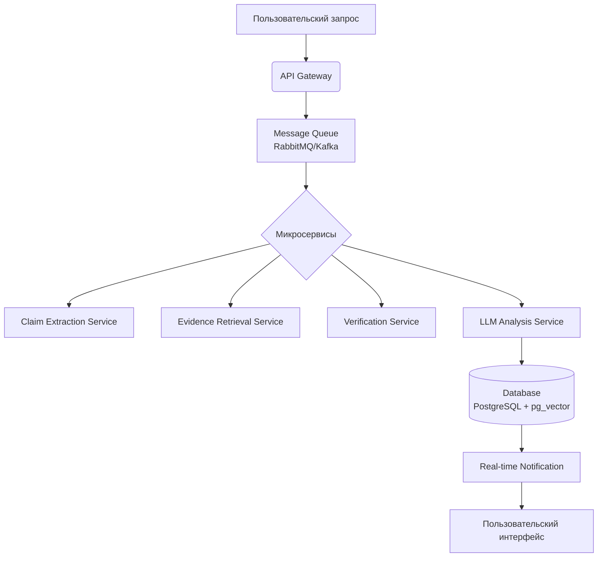
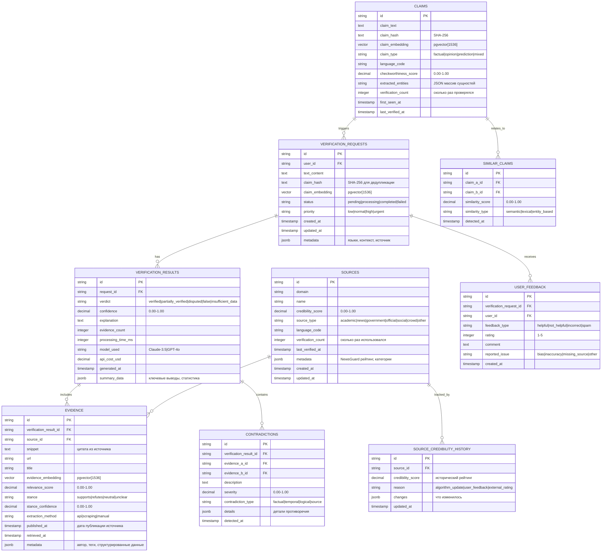
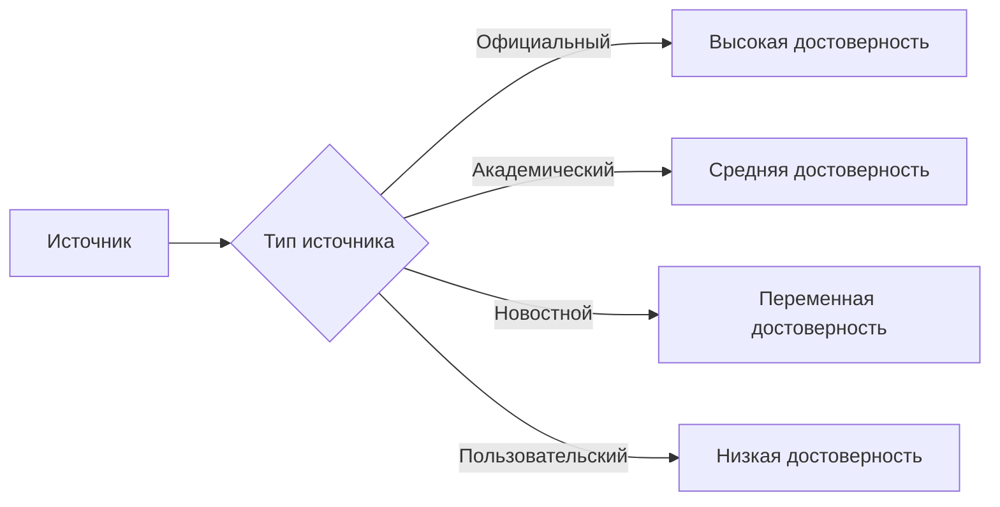
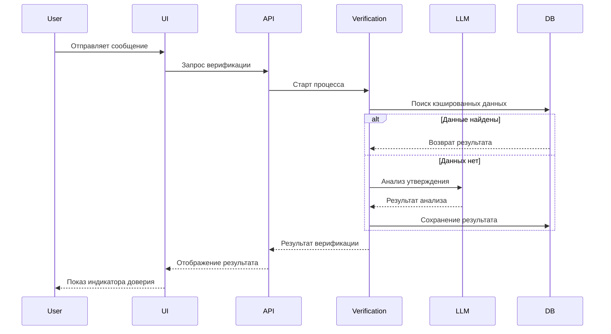

# План разработки системы проверки фактов и источников

**Цель**: Создать real-time систему верификации информации с интеграцией в чат-интерфейс Ailocks

**Сроки**: 4 недели

---

## Архитектура системы


## Диаграмма связей в базе данных



## Подробное описание сущностей с примерами

### 1. VERIFICATION_REQUESTS (Запросы на верификацию)
**Назначение**: Хранение всех запросов пользователей на проверку информации

**Пример содержимого**:
```json
{
  "id": "vr_123e4567-e89b-12d3-a456-426614174000",
  "user_id": "user_987fcdeb-51f2-4a8d-b123-123456789abc",
  "text_content": "В 2024 году население России составляет 146 миллионов человек",
  "claim_hash": "a1b2c3d4e5f6789012345678901234567890abcdef1234567890abcdef123456",
  "claim_embedding": [0.123, -0.456, 0.789, ...], // 1536 dimensions
  "status": "completed",
  "priority": "normal",
  "created_at": "2024-01-15T10:30:00Z",
  "updated_at": "2024-01-15T10:30:05Z",
  "metadata": {
    "language": "ru",
    "context": "conversation about demographics",
    "source": "chat_message",
    "user_location": {"country": "RU", "city": "Moscow"}
  }
}
```

### 2. VERIFICATION_RESULTS (Результаты верификации)
**Назначение**: Итоговые результаты проверки с выводами и метриками

**Пример содержимого**:
```json
{
  "id": "vres_789a1234-b567-8901-c234-def567890123",
  "request_id": "vr_123e4567-e89b-12d3-a456-426614174000",
  "verdict": "partially_verified",
  "confidence": 0.85,
  "explanation": "Официальная статистика Росстата показывает 146.4 млн человек на январь 2024, но есть расхождения в методологии подсчета",
  "evidence_count": 5,
  "processing_time_ms": 3240,
  "model_used": "Claude-3.5-Sonnet",
  "api_cost_usd": 0.0012,
  "generated_at": "2024-01-15T10:30:05Z",
  "summary_data": {
    "key_findings": ["Росстат: 146.4 млн", "ООН: 144.7 млн", "Разные методологии"],
    "consensus_level": "moderate",
    "temporal_relevance": "current"
  }
}
```

### 3. SOURCES (Источники информации)
**Назначение**: Каталог всех источников с оценками надежности

**Пример содержимого**:
```json
{
  "id": "src_abc123def456",
  "domain": "rosstat.gov.ru",
  "name": "Федеральная служба государственной статистики",
  "credibility_score": 0.95,
  "source_type": "government",
  "language_code": "ru",
  "verification_count": 1247,
  "last_verified_at": "2024-01-15T09:00:00Z",
  "metadata": {
    "newsguard_rating": 85,
    "categories": ["statistics", "demographics", "official"],
    "bias_rating": "neutral",
    "fact_check_rating": "high"
  },
  "created_at": "2023-01-01T00:00:00Z",
  "updated_at": "2024-01-15T09:00:00Z"
}
```

### 4. EVIDENCE (Доказательства)
**Назначение**: Конкретные фрагменты информации из источников

**Пример содержимого**:
```json
{
  "id": "ev_567890abcdef",
  "verification_result_id": "vres_789a1234-b567-8901-c234-def567890123",
  "source_id": "src_abc123def456",
  "snippet": "По данным Росстата, численность постоянного населения России на 1 января 2024 года составила 146,4 млн человек",
  "url": "https://rosstat.gov.ru/folder/12781",
  "title": "Численность населения Российской Федерации",
  "evidence_embedding": [0.234, -0.567, 0.890, ...],
  "relevance_score": 0.92,
  "stance": "supports",
  "stance_confidence": 0.89,
  "extraction_method": "api",
  "published_at": "2024-01-10T00:00:00Z",
  "retrieved_at": "2024-01-15T10:30:02Z",
  "metadata": {
    "author": "Росстат",
    "tags": ["официальная статистика", "демография"],
    "structured_data": {
      "population": 146400000,
      "date": "2024-01-01",
      "methodology": "permanent_residents"
    }
  }
}
```

### 5. CONTRADICTIONS (Противоречия)
**Назначение**: Выявленные несоответствия между источниками

**Пример содержимого**:
```json
{
  "id": "contr_abc123",
  "verification_result_id": "vres_789a1234-b567-8901-c234-def567890123",
  "evidence_a_id": "ev_567890abcdef",
  "evidence_b_id": "ev_890123fedcba",
  "description": "Расхождение в 1.7 млн человек между данными Росстата (146.4 млн) и оценкой ООН (144.7 млн)",
  "severity": 0.65,
  "contradiction_type": "factual",
  "details": {
    "difference_absolute": 1700000,
    "difference_percentage": 1.16,
    "possible_reasons": ["different methodologies", "different counting dates", "migration estimates"],
    "resolution_complexity": "moderate"
  },
  "detected_at": "2024-01-15T10:30:04Z"
}
```

### 6. USER_FEEDBACK (Обратная связь пользователей)
**Назначение**: Отзывы пользователей для улучшения системы

**Пример содержимого**:
```json
{
  "id": "fb_def456",
  "verification_request_id": "vr_123e4567-e89b-12d3-a456-426614174000",
  "user_id": "user_987fcdeb-51f2-4a8d-b123-123456789abc",
  "feedback_type": "helpful",
  "rating": 4,
  "comment": "Хорошая проверка, но хотелось бы больше международных источников",
  "reported_issue": null,
  "created_at": "2024-01-15T11:00:00Z"
}
```

### 7. SOURCE_CREDIBILITY_HISTORY (История надежности источников)
**Назначение**: Отслеживание изменений рейтингов источников

**Пример содержимого**:
```json
{
  "id": "sch_789",
  "source_id": "src_abc123def456",
  "credibility_score": 0.95,
  "reason": "external_rating",
  "changes": {
    "previous_score": 0.92,
    "score_change": +0.03,
    "factors": ["improved transparency", "fact-check recognition"],
    "external_ratings": {
      "newsguard": 85,
      "media_bias_fact_check": "high"
    }
  },
  "updated_at": "2024-01-15T09:00:00Z"
}
```

### 8. CLAIMS (Утверждения)
**Назначение**: Нормализованные утверждения для дедупликации

**Пример содержимого**:
```json
{
  "id": "claim_456789",
  "claim_text": "население России составляет 146 миллионов человек в 2024 году",
  "claim_hash": "b2c3d4e5f6789012345678901234567890abcdef1234567890abcdef123456",
  "claim_embedding": [0.345, -0.678, 0.901, ...],
  "claim_type": "factual",
  "language_code": "ru",
  "checkworthiness_score": 0.88,
  "extracted_entities": ["Россия", "146 миллионов", "2024 год", "население"],
  "verification_count": 3,
  "first_seen_at": "2024-01-10T08:00:00Z",
  "last_verified_at": "2024-01-15T10:30:00Z"
}
```

### 9. SIMILAR_CLAIMS (Похожие утверждения)
**Назначение**: Связи между семантически похожими утверждениями

**Пример содержимого**:
```json
{
  "id": "sim_123abc",
  "claim_a_id": "claim_456789",
  "claim_b_id": "claim_789012",
  "similarity_score": 0.94,
  "similarity_type": "semantic",
  "detected_at": "2024-01-15T10:30:01Z"
}
```

## Структура проекта
```
netlify/functions/
├── fact-check/
│   ├── core.ts             # Основная логика верификации
│   ├── sources.ts          # Интеграции с источниками
│   ├── credibility.ts      # Система оценки достоверности
│   └── types.ts            # Типы данных
src/components/
├── FactCheck/
│   ├── FactCheckPanel.tsx  # UI панели верификации
│   ├── SourceViewer.tsx    # Просмотр источников
│   └── TrustBadge.tsx      # Индикатор доверия
lib/
├── verification/
│   ├── claim-parser.ts     # Парсер утверждений
│   ├── evidence-retriever.ts # Поиск доказательств
│   └── scoring.ts          # Система оценки
```

## Схемы данных TypeScript

```typescript
// Файл: src/lib/verification/types.ts

// Основные модели данных
export interface VerificationRequest {
  id: string;
  userId: string;
  textContent: string;
  claimHash: string;
  claimEmbedding: number[];
  status: 'pending'|'processing'|'completed'|'failed';
  priority: 'low'|'normal'|'high'|'urgent';
  createdAt: Date;
  updatedAt: Date;
  metadata: {
    language: string;
    context?: string;
    source: string;
    userLocation?: {
      country: string;
      city: string;
    };
  };
}

export interface VerificationResult {
  id: string;
  requestId: string;
  verdict: 'verified'|'partially_verified'|'disputed'|'false'|'insufficient_data';
  confidence: number;
  explanation: string;
  evidenceCount: number;
  processingTimeMs: number;
  modelUsed: string;
  apiCostUsd: number;
  generatedAt: Date;
  summaryData: {
    keyFindings: string[];
    consensusLevel: 'high'|'moderate'|'low';
    temporalRelevance: 'current'|'outdated'|'timeless';
  };
}

export interface Source {
  id: string;
  domain: string;
  name: string;
  credibilityScore: number;
  sourceType: 'academic'|'news'|'government'|'official'|'social'|'crowd'|'other';
  languageCode: string;
  verificationCount: number;
  lastVerifiedAt: Date;
  metadata: {
    newsguardRating?: number;
    categories: string[];
    biasRating?: string;
    factCheckRating?: string;
  };
  createdAt: Date;
  updatedAt: Date;
}

export interface Evidence {
  id: string;
  verificationResultId: string;
  sourceId: string;
  snippet: string;
  url: string;
  title: string;
  evidenceEmbedding: number[];
  relevanceScore: number;
  stance: 'supports'|'refutes'|'neutral'|'unclear';
  stanceConfidence: number;
  extractionMethod: 'api'|'scraping'|'manual';
  publishedAt: Date;
  retrievedAt: Date;
  metadata: {
    author?: string;
    tags: string[];
    structuredData?: Record<string, any>;
  };
}

export interface Contradiction {
  id: string;
  verificationResultId: string;
  evidenceAId: string;
  evidenceBId: string;
  description: string;
  severity: number;
  contradictionType: 'factual'|'temporal'|'logical'|'source';
  details: {
    differenceAbsolute?: number;
    differencePercentage?: number;
    possibleReasons: string[];
    resolutionComplexity: 'low'|'moderate'|'high';
  };
  detectedAt: Date;
}

export interface UserFeedback {
  id: string;
  verificationRequestId: string;
  userId: string;
  feedbackType: 'helpful'|'not_helpful'|'incorrect'|'spam';
  rating: number;
  comment?: string;
  reportedIssue?: 'bias'|'inaccuracy'|'missing_source'|'other';
  createdAt: Date;
}
```

## Этапы разработки

**Неделя 1: Базовый функционал**
- [ ] Реализация Claim Extraction Service
- [ ] Интеграция с Google Fact Check Tools API
- [ ] Создание схемы БД для хранения результатов
- [ ] Разработка ядра системы оценки достоверности

**Неделя 2: Расширенные возможности**
- [ ] Интеграция с NewsAPI и Wikidata
- [ ] Реализация LLM Analysis Service (Claude 3.5)
- [ ] Разработка системы обнаружения противоречий
- [ ] Создание механизма кэширования результатов

**Неделя 3: Пользовательский интерфейс**
- [ ] Компонент FactCheckPanel для отображения результатов
- [ ] Интерактивный SourceViewer
- [ ] Система индикации доверия в чате
- [ ] Интеграция с голосовым интерфейсом

**Неделя 4: Оптимизация и интеграция**
- [ ] Gamification: XP за использование системы
- [ ] Мобильная адаптация компонентов
- [ ] Система user feedback для улучшения точности
- [ ] Performance tuning и нагрузочное тестирование

## Ключевые особенности

1. **Многоуровневая верификация**:
   - Быстрая проверка по кэшированным данным
   - Глубокая верификация при отсутствии данных
   - Экспертная верификация для спорных случаев

2. **Система оценки источников**:


3. **Механизм обнаружения противоречий**:
   - Сравнение утверждений из разных источников
   - Семантический анализ различий
   - Визуализация противоречий в интерфейсе

4. **Пользовательский опыт**:
   - Инлайн-индикаторы в чате
   - Детальные отчеты в один клик
   - История проверок в профиле
   - Голосовые команды для верификации

## Диаграмма последовательности


## Метрики качества

1. **Точность**:
   - >90% для проверенных фактов
   - <5% ложных срабатываний

2. **Производительность**:
   - <3s время ответа для 95% запросов
   - Поддержка 1000 RPM

3. **Надежность**:
   - 99.9% uptime
   - Автоматическое восстановление при сбоях

Этот план предоставляет детализированную roadmap для реализации системы проверки фактов, сочетающую технические требования с пользовательским опытом.
